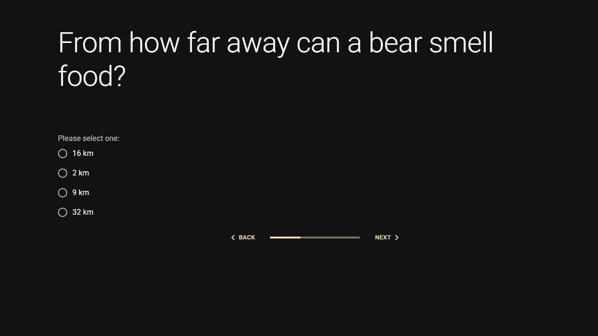

# Present Connection internship task

## A simple quiz web app

This project is built with React (TypeScript) and ASP.NET Core with an In-memory database.

### Instructions

#### Visual Studio 2022
1. Open solution file
2. Start project[^1]
3. Web app should launch in browser[^2]

#### VS Code (Frontend project only)
1. Go to 'pc.quiz.client' in terminal
2. Run command:

```
npm run dev
```

### Backend Key Points
- Clean/Onion architecture implementation
- Using CQRS and Mediator design patterns
- Exception Filters

### Frontend Key Points
- TanStack + Axios layers in frontend
- Material UI[^3]
- Vite

### Needed improvements
- Exception handling middleware
- Code style consistency
- Better React context management
- Unit or other tests
- Query key storage
- Environment variable usage

### Example screenshots



### Additional Information

[^1]: It's possible certain errors will appear due to certificates not being able to be generated. In which case, I recommend using manual solutions to create a certificate.

[^2]: If the browser doesn't open up by itself, you can copy and go to the localhost URL.

[^3]: Decided for in-line CSS for styling components instead of CSS modules due to better compatibility.